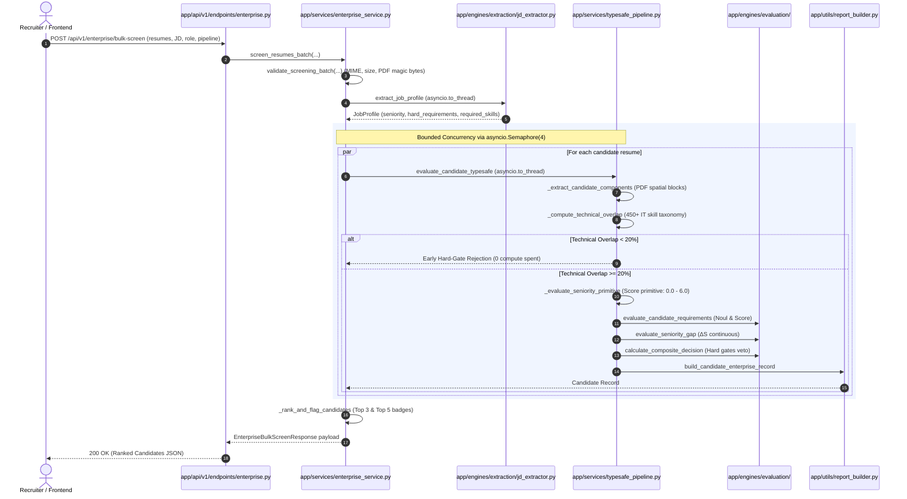
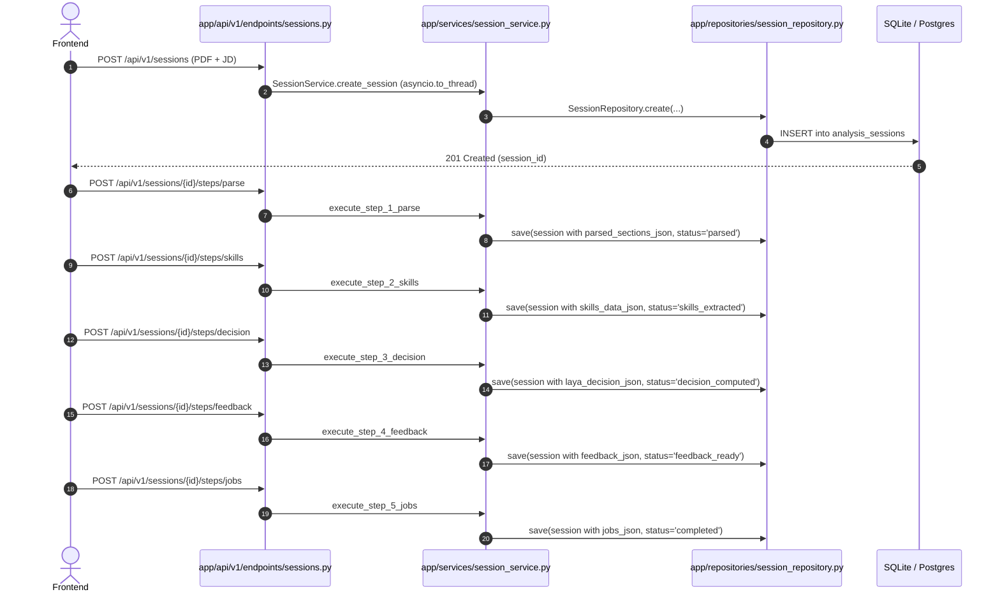

# CareerLens AI — Code Flow & Architecture Guide

> A comprehensive walkthrough of the CareerLens AI backend architecture, request execution flows, and a step-by-step reading roadmap designed for developers and architects.

---

## 1. System Philosophy & Core Design Principles

CareerLens AI is built on the **TypeSafe System One Architecture**:

- **Zero Generative Prompting**: The system does **not** rely on vague prompts like _"evaluate this resume and give a score"_.
- **Atomic Typed Primitives**: Decisions are decomposed into three typed primitives:
  1. `Choice`: Categorical classification over finite options (e.g. Role Family).
  2. `Score`: Calibrated numeric ratings along fixed ordinal scales (e.g. Seniority 0.0 to 6.0).
  3. `Noul`: Deterministic binary judgments (`True` / `False`) for hard eligibility criteria.
- **Dual-Pipeline Execution**:
  - `typesafe`: Official TypeSafe Python SDK with System One cloud API.
  - `laya_local`: Offline, air-gapped on-premise inference with sub-second execution.
- **Strict Layered Boundaries**:
  - **Controllers (`app/api/v1/endpoints/`)**: Ultra-thin HTTP controllers handling validation, status codes, and JSON serialization.
  - **Core & Config (`app/core/`)**: Application configuration, logging, database engine, and global validators.
  - **Domain & DB Models (`app/models/`)**: Explicit separation between database ORM entities (`models/db/`) and pure domain models (`models/domain/`).
  - **Pydantic Schemas (`app/schemas/`)**: Decoupled DTO contracts grouped by domain (`enterprise.py`, `session.py`, `analysis.py`).
  - **Repositories (`app/repositories/`)**: Database queries, transactions, and session persistence.
  - **Services (`app/services/`)**: Business workflow orchestration, async concurrency control, and memory safety.
  - **Engines (`app/engines/`)**: Deterministic parsing, keyword ontology, TypeSafe/Laya System One scoring, and pure evaluation primitives.

---

## 2. Architecture Map & Subsystem Responsibilities

```
                                  [ Client Requests ]
                                           │
                                           ▼
                                 [ app/main.py (FastAPI) ]
                                           │
                                [ app/api/v1/router.py ]
                                           │
         ┌─────────────────────────────────┼────────────────────────────────┐
         ▼                                 ▼                                ▼
[ Enterprise Endpoints ]          [ Session Endpoints ]           [ Analysis Endpoints ]
(api/v1/endpoints/enterprise)    (api/v1/endpoints/sessions)     (api/v1/endpoints/analysis)
         │                                 │                                │
         ▼                                 ▼                                ▼
[ Enterprise Service ]           [ Session Service ]             [ Analysis Service ]
(services/enterprise_service)     (services/session_service)      (services/analysis_service)
         │                                 │                                │
         │                                 ▼                                │
         │                      [ Session Repository ]                      │
         │                      (repositories/session_repo)                 │
         │                                 │                                │
         │                                 ▼                                │
         │                        [ DB Session Model ]                      │
         │                        (models/db/session.py)                    │
         │                                                                  │
         └─────────────────────────────────┬────────────────────────────────┘
                                           │
                 ┌─────────────────────────┴────────────────────────┐
                 ▼                                                  ▼
      [ Layout-Aware PDF Parser ]                       [ Tech Keyword Extractor ]
      (engines/parser/pdf_parser)                       (engines/extraction/tech_keywords)
                 │                                                  │
                 └─────────────────────────┬────────────────────────┘
                                           │
                                           ▼
                          [ TypeSafe / Laya System One ]
                          (services/typesafe_pipeline)
                           ├── Choice, Score, Noul
                           ├── engines/jev/ & engines/laya/
                           └── engines/evaluation/
                                ├── Continuous Seniority Gap ΔS
                                ├── Hard Gate Veto Logic
                                └── Composite Score Aggregator
                                           │
                                           ▼
                               [ Report Serialization ]
                              (utils/report_builder.py)
```

---

## 3. End-to-End Execution Flows

### Flow A: Enterprise Bulk Screening (`POST /api/enterprise/bulk-screen`)

Used by recruiters to upload up to 15 PDF resumes and screen them concurrently against a Job Description.



---

### Flow B: Step-by-Step Analysis Sessions (`/api/v1/sessions`)

Used for sequential stateful inspection where recruiters or applicants inspect intermediate reasoning step-by-step.



---

## 4. How to Read the Code (Recommended Reading Roadmap)

To understand this codebase in the fastest, most intuitive way, read the files in the following **7-stage order**:

### Stage 1: The App Entrypoint & Configuration

1. **[`backend/app/core/config.py`](file:///c:/Users/kumar/OneDrive/Desktop/My_projects/career-lens-ai/backend/app/core/config.py)**:
   - Understand all environment variables, limits (`MAX_BATCH_SIZE=15`, `MAX_CONCURRENT_EVALUATIONS=4`, `MAX_UPLOAD_SIZE_MB=10`), and database settings.
2. **[`backend/app/main.py`](file:///c:/Users/kumar/OneDrive/Desktop/My_projects/career-lens-ai/backend/app/main.py)**:
   - Notice the lifespan startup event (loads taxonomy and preloads Laya models) and router mounting.

### Stage 2: Data Models & Pydantic Contracts

1. **[`backend/app/models/domain/job.py`](file:///c:/Users/kumar/OneDrive/Desktop/My_projects/career-lens-ai/backend/app/models/domain/job.py)**:
   - Look at `JobProfile` and `RequirementItem`.
2. **[`backend/app/models/domain/candidate.py`](file:///c:/Users/kumar/OneDrive/Desktop/My_projects/career-lens-ai/backend/app/models/domain/candidate.py)**:
   - Look at `CandidateProfile` and `ResumeBlock` (spatial metadata from PDF).
3. **[`backend/app/schemas/`](file:///c:/Users/kumar/OneDrive/Desktop/My_projects/career-lens-ai/backend/app/schemas/)**:
   - The decoupled domain contracts shared with the client: `enterprise.py` (`EnterpriseBulkScreenResponse`, `JDPreviewResponse`), `session.py` (`SessionCreateRequest`, `SessionStepResponse`), `analysis.py`.

### Stage 3: The API Controllers (Thin Layer)

1. **[`backend/app/api/v1/endpoints/enterprise.py`](file:///c:/Users/kumar/OneDrive/Desktop/My_projects/career-lens-ai/backend/app/api/v1/endpoints/enterprise.py)**:
   - Shows how `preview-requirements` and `bulk-screen` receive multipart uploads and delegate to services.
2. **[`backend/app/api/v1/endpoints/sessions.py`](file:///c:/Users/kumar/OneDrive/Desktop/My_projects/career-lens-ai/backend/app/api/v1/endpoints/sessions.py)**:
   - Shows how individual sequential steps (1 to 5) are exposed over REST.
3. **[`backend/app/api/v1/router.py`](file:///c:/Users/kumar/OneDrive/Desktop/My_projects/career-lens-ai/backend/app/api/v1/router.py)**:
   - Aggregates all endpoints into versioned routers.

### Stage 4: Service Orchestration (Business Core)

1. **[`backend/app/services/enterprise_service.py`](file:///c:/Users/kumar/OneDrive/Desktop/My_projects/career-lens-ai/backend/app/services/enterprise_service.py)**:
   - Reads uploads, bounds concurrency with `asyncio.Semaphore`, gathers candidate tasks, and ranks the Top 3.
2. **[`backend/app/services/typesafe_pipeline.py`](file:///c:/Users/kumar/OneDrive/Desktop/My_projects/career-lens-ai/backend/app/services/typesafe_pipeline.py)**:
   - The heart of single candidate evaluation. Decomposed into clean modular sub-functions:
     - `_extract_candidate_components`
     - `_compute_technical_overlap`
     - `_build_hard_gate_rejection_record`
     - `_evaluate_seniority_primitive`
     - `_evaluate_requirements_and_decision`
3. **[`backend/app/services/session_service.py`](file:///c:/Users/kumar/OneDrive/Desktop/My_projects/career-lens-ai/backend/app/services/session_service.py)**:
   - Orchestrates steps using `_execute_step_transaction` without redundant try/except boilerplate.

### Stage 5: Deterministic PDF Parsing & Skill Extraction

1. **[`backend/app/engines/parser/layout_analyzer.py`](file:///c:/Users/kumar/OneDrive/Desktop/My_projects/career-lens-ai/backend/app/engines/parser/layout_analyzer.py)**:
   - `detect_column_split` handles two-column resumes by computing word boundary crossings.
2. **[`backend/app/engines/parser/pdf_parser.py`](file:///c:/Users/kumar/OneDrive/Desktop/My_projects/career-lens-ai/backend/app/engines/parser/pdf_parser.py)**:
   - Uses `pdfplumber` to extract text lines, typography (bold/sizes), and hyperlinks.
3. **[`backend/app/engines/extraction/tech_keywords.py`](file:///c:/Users/kumar/OneDrive/Desktop/My_projects/career-lens-ai/backend/app/engines/extraction/tech_keywords.py)**:
   - The deterministic 450+ IT skill ontology with parent-domain hierarchy.

### Stage 6: Jev & Laya Primitives (System One)

1. **[`backend/app/engines/jev/rubric.py`](file:///c:/Users/kumar/OneDrive/Desktop/My_projects/career-lens-ai/backend/app/engines/jev/rubric.py)**:
   - Versioned Python dictionaries defining seniority levels (0 to 6) and criteria.
2. **[`backend/app/engines/jev/client.py`](file:///c:/Users/kumar/OneDrive/Desktop/My_projects/career-lens-ai/backend/app/engines/jev/client.py)** & **[`backend/app/engines/laya/client.py`](file:///c:/Users/kumar/OneDrive/Desktop/My_projects/career-lens-ai/backend/app/engines/laya/client.py)**:
   - The two interchangeable engines for evaluating typed questions (`predict()`).

### Stage 7: Evaluation, Logic Gates & Decisions

1. **[`backend/app/engines/evaluation/seniority_evaluator.py`](file:///c:/Users/kumar/OneDrive/Desktop/My_projects/career-lens-ai/backend/app/engines/evaluation/seniority_evaluator.py)**:
   - Computes continuous seniority gap $\Delta S = S_{\text{candidate}} - S_{\text{JD}}$ and fit percentage.
2. **[`backend/app/engines/evaluation/composite_score.py`](file:///c:/Users/kumar/OneDrive/Desktop/My_projects/career-lens-ai/backend/app/engines/evaluation/composite_score.py)**:
   - Aggregates dimension scores into a composite probability, enforces hard gate vetos, and decides `SELECT` / `BORDERLINE` / `REJECT`.
3. **[`backend/app/utils/report_builder.py`](file:///c:/Users/kumar/OneDrive/Desktop/My_projects/career-lens-ai/backend/app/utils/report_builder.py)**:
   - Standardizes response formatting for frontend contracts.

---

## 5. Summary of Architectural Improvements

| Area                       | Before                                                          | After                                                                   | Benefit                                                                      |
| :------------------------- | :-------------------------------------------------------------- | :---------------------------------------------------------------------- | :--------------------------------------------------------------------------- |
| **`typesafe_pipeline.py`** | 220-line monolithic function                                    | 5 modular, single-responsibility sub-functions (<35 lines each)         | Readability, testability, and isolated debugging.                            |
| **`candidate_scorer.py`**  | 240-line procedural function                                    | 6 specialized pure helpers                                              | Eliminates code sprawl; enables unit testing of individual scoring rules.    |
| **`session_service.py`**   | 80 lines of duplicate try/except/rollback code across 5 methods | Single `_execute_step_transaction` wrapper                              | DRYer code, uniform HTTP status handling, and reliable transaction safety.   |
| **`layout_analyzer.py`**   | Divergent column splitting logic                                | Unified crossing-words gutter algorithm                                 | Consistent two-column PDF parsing across both screening pipelines.           |
| **Event-Loop Safety**      | Potential blocking on CPU tasks                                 | Non-blocking execution with `asyncio.to_thread` and `asyncio.Semaphore` | Eliminates event loop freezes and prevents OOM crashes on large PDF batches. |
| **Automated Testing**      | 34 initial tests                                                | **47 tests (100% passing)** in ~6 seconds                               | Complete behavioral safety and regression prevention.                        |
