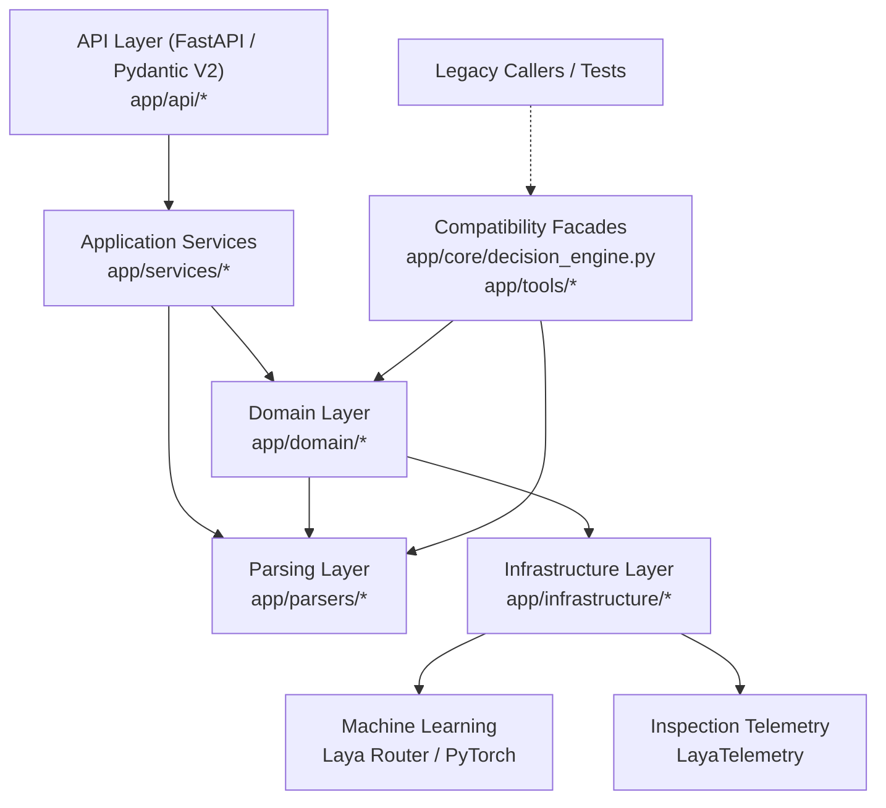

# System Architecture: Clean Architecture & Domain-Driven Design

## 🏛️ Architectural Overview

CareerLens AI follows **Clean Architecture** (Ports & Adapters) and **Domain-Driven Design (DDD)** principles. The codebase is organized into unidirectional dependency layers, ensuring that core business rules and algorithms do not depend on external frameworks, transport protocols, or database drivers.

---

## 🧱 Layer Responsibilities & Boundaries

### 1. Domain Layer (`backend/app/domain/`)

The heart of the application containing pure business logic, scoring formulas, and seniority classification. It has zero dependencies on web frameworks.

- **`domain/seniority/classifier.py`**:
  - Classifies Job Description seniority into `beginner` (0-2y), `mid_level` (3-5y), or `senior` (6+y).
  - Dynamically activates `ROLE_WEIGHTS` tailored to the seniority level.
  - Classifies candidate career level using calendar span heuristics and Laya inference.
  - **Memoization**: Uses an in-memory MD5 cache (`_jd_cache`) so that in a batch of 15 resumes, the JD is evaluated **exactly once** instead of 15 redundant times.
- **`domain/scoring/calibrated_scorer.py`**:
  - Computes continuous expected quality score from Laya 3-class softmax outputs:
    $$\text{Dimension Score} = \max(0.0, 1.0 \cdot P(\text{high}) + 0.35 \cdot P(\text{mid}) - 0.60 \cdot P(\text{low}))$$
  - Applies least-high-hits penalty: $\max(0.0, (3 - H) \times 0.02)$.
  - Resolves categorical match decisions (`Strong match`, `Moderate match`, `Borderline match`, `Poor fit`).
- **`domain/scoring/candidate_evaluator.py`**:
  - Coordinates multi-dimensional evaluation: formats ground-truth anchored prompts, dispatches questions to `LayaClient`, computes parameter evaluations, and records telemetry.
- **`domain/scoring/candidate_scorer.py`**:
  - Combines deterministic skill overlap (50%) with calibrated ML probability (50%) into a unified fit score (0-100%).

### 2. Infrastructure Layer (`backend/app/infrastructure/`)

Encapsulates external dependencies, ML inference engines, and telemetry collectors.

- **`infrastructure/ml/laya_client.py`**:
  - Singleton wrapper around `laya.Router`.
  - Enforces thread safety and caps PyTorch CPU inference threads (`torch.set_num_threads(2)` and `set_num_interop_threads(2)`) to prevent CPU starvation and Docker container restarts.
- **`infrastructure/ml/prompt_templates.py`**:
  - Formulates ground-truth anchored prompts: injects deterministic skill matches, missing requirements, candidate experience, and education.
  - Generates the 5 standardized evaluation questions across Technical, Experience, Domain, Education, and Evidence.
- **`infrastructure/ml/heuristic_fallback.py`**:
  - Provides a 100% deterministic mathematical evaluation fallback when the Laya model weights are unavailable or offline.
- **`infrastructure/telemetry/laya_telemetry.py`**:
  - Transparent audit trail capturing prompt context, exact questions asked to Laya, raw 3-class softmax probability distributions, dominant predictions, and inference latency.

### 3. Parsing Layer (`backend/app/parsers/`)

High-speed, zero-LLM text extraction engines operating under 50ms per resume.

- **`parsers/resume_parser.py`**:
  - Spatial and typographic PDF parser using `pdfplumber`.
  - Column split detection for two-column resumes.
  - Embedded PDF hyperlink extraction (LinkedIn, GitHub, Portfolio).
  - Finite State Machine (FSM) for streaming section segmentation based on `SECTION_TAXONOMY`.
  - Deterministic contact information extraction (email, phone, URLs).
- **`parsers/skill_extractor.py`**:
  - Boundary-accurate regex extraction of 450+ IT technical skills.
  - Symbol-aware matching for `C++`, `C#`, `.NET`, `CI/CD`, and `Go`.
  - Alias normalization (e.g. `k8s` $\rightarrow$ `Kubernetes`, `postgres` $\rightarrow$ `PostgreSQL`).
  - Categorization into 14 IT engineering domains.
  - Candidate role affinity calculation across 17 engineering job profiles.

### 4. Application Services Layer (`backend/app/services/`)

Coordinates business workflows, concurrent execution, and presentation data structures.

- **`services/enterprise_screening_service.py`**:
  - Orchestrates batch screening of up to 15 PDF resumes.
  - Throttles concurrent CPU-bound evaluations using `asyncio.Semaphore(2)`.
  - Offloads PDF parsing and model inference to background worker threads via `asyncio.to_thread`.
  - Assembles candidate inspection records, ranks candidates descending by fit score, and flags Top 3 and Top 5 candidates.
- **`services/analysis_service.py`**:
  - Handles single resume deep analysis, generating actionable feedback, elevation roadmaps, and strengths/growth areas.
- **`services/session_service.py`**:
  - Manages interactive candidate arena showcases and session state persistence in SQLite.

### 5. Interface Layer (`backend/app/api/`)

Exposes HTTP endpoints using FastAPI and validates request/response contracts with Pydantic V2.

- **`api/enterprise_routes.py`**:
  - `POST /api/v1/enterprise/bulk-screen`: Multipart form endpoint accepting Job Role, Job Description, and up to 15 PDF files.
  - `POST /api/v1/enterprise/export-screening-report`: Generates downloadable CSV reports of screening batches.
- **`api/schemas.py`**:
  - Pydantic models with `ConfigDict(extra="allow")` guaranteeing forward and backward compatibility.

---

## 🔄 Backward Compatibility Facades

To ensure zero regressions across existing unit tests, legacy imports, and external integrations, clean facade shims are maintained:

1. **`app.core.decision_engine`**:
   - Re-exports `decision_engine`, `LayaDecisionEngine`, `ROLE_WEIGHTS`, `SENIORITY_LABELS`.
   - Delegates all classification and evaluation methods directly to `app.domain.seniority.classifier` and `app.domain.scoring.candidate_evaluator`.
2. **`app.tools.candidate_scorer`**:
   - Re-exports `score_resume_against_jd` and `score_resume_against_jd_zero_llm` from `app.domain.scoring.candidate_scorer`.
3. **`app.tools.deterministic_parser`**:
   - Re-exports `parse_resume_from_pdf`, `parse_resume_from_text`, and `SECTION_TAXONOMY` from `app.parsers.resume_parser`.
4. **`app.tools.tech_keyword_extractor`**:
   - Re-exports `TechKeywordExtractor` and `extract_tech_keywords` from `app.parsers.skill_extractor`.
