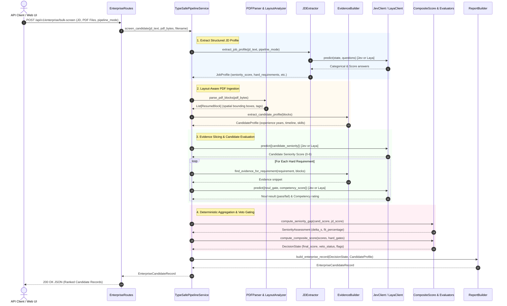

# CareerLens AI End-to-End Data Flow

This document details the exact sequence of transformations, state representations, and data flows from raw input to final evaluation output in CareerLens AI.

---

## Complete Lifecycle Diagram

---

## Detailed Step Walkthrough

### Step 1: Input Ingestion
- Client submits `multipart/form-data`:
  - `job_description`: Raw text of the job description.
  - `resumes`: Array of binary PDF uploads.
  - `pipeline`: `"typesafe_langchain"` (default) or `"laya_local"`.

### Step 2: JD Normalization (`app/extraction/jd_extractor.py`)
- Regex extractors identify explicit experience ranges (e.g., `"5+ years"` -> `min_years_experience = 5`).
- TypeSafe questions resolve:
  - `role_family` via **Choice**
  - `seniority_score` via **Score** (`0` to `6`)
  - `education_level` via **Choice**
- Output: normalized `JobProfile` instance.

### Step 3: Layout-Aware Parsing (`app/parser/`)
- PDF streams are processed through `pdfplumber`.
- Horizontal analysis identifies multiple columns and splits left-column skills from right-column experience, preventing word interleaving.
- Text lines are clustered into semantic `ResumeBlock` units with spatial coordinates and section labels (`technical`, `experience`, `education`, etc.).

### Step 4: Seniority & Competency Evaluation (`app/evaluation/`)
- **Seniority**: Evaluated on the 7-level ordered scale. The gap $\Delta S = S_{\text{resume}} - S_{\text{JD}}$ computes the exact fit percentage.
- **Evidence Slicing**: For each requirement, relevant blocks are collected and scored for evidence strength (`none` to `very_strong`).
- **Binary Hard Gates**: Mandatory requirements are tested via `Noul`. Any failure triggers `HardRequirementGate.is_passed = False`.

### Step 5: Scoring Aggregation & Veto Gate (`app/evaluation/composite_score.py`)
- Sub-scores are combined according to the rubric weights:
  - Technical Competency: 25%
  - Seniority Alignment: 20%
  - Experience Duration: 20%
  - Domain Fit: 15%
  - Specific Requirements: 15%
  - Education Fit: 5%
- If any mandatory gate failed:
  - `is_vetoed = True`
  - Score capped at `35.0`
  - Flag added: `HARD_REQUIREMENT_FAILED`

### Step 6: Enterprise Output Generation (`app/report/report_builder.py`)
- The `DecisionState` and `CandidateProfile` are serialized into an `EnterpriseCandidateRecord`.
- Response includes candidate name, final score, fit status, telemetry, confidence tier, and itemized strengths/weaknesses.

