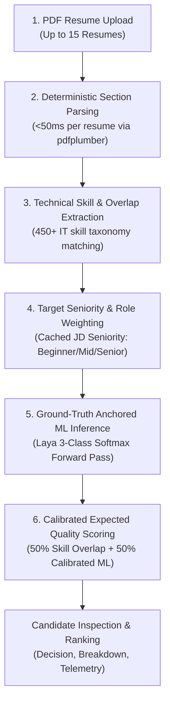

# Candidate Screening Pipeline & Decision Scoring

## 🔄 End-to-End Evaluation Pipeline

The CareerLens AI candidate evaluation pipeline operates in **6 sequential stages**:



---

## 🔬 Stage-by-Stage Breakdown

### Stage 1: Batch Ingestion & Throttling

- When up to 15 resumes are uploaded via `POST /api/v1/enterprise/bulk-screen`, the service validates PDF MIME types and extensions.
- Concurrent evaluations are throttled using an `asyncio.Semaphore(2)`. This prevents CPU saturation in Docker environments and keeps PyTorch inference stable.

### Stage 2: Deterministic Section Parsing (`parsers/resume_parser.py`)

- Resumes are parsed into structured sections (`summary`, `experience`, `education`, `skills`, `projects`, `certifications`) without LLM calls.
- **Column Detection**: Checks page bounding boxes; if a two-column layout is detected, text streams are split at the median gutter to preserve logical reading order.
- **Hyperlink Extraction**: Extracts embedded PDF annotation links (LinkedIn, GitHub, Portfolios).
- **Contact & Name**: Extracts candidate name, email, phone number, and social links using deterministic regex.

### Stage 3: Technical Overlap & Skill Extraction (`parsers/skill_extractor.py`)

- Analyzes both the Job Description and the Candidate Resume against the 450+ skill database.
- Calculates:
  - $\text{Matched Skills}$: Skills present in both the JD and the candidate resume.
  - $\text{Missing JD Skills}$: Critical requirements in the JD absent from the candidate resume.
  - $\text{Candidate Bonus Skills}$: Additional technical competencies possessed by the candidate outside the JD requirements.
  - $\text{Skill Overlap \%} = \frac{|\text{Matched Skills}|}{\max(1, |\text{JD Skills}|)} \times 100\%$

### Stage 4: Seniority Classification & Role Weights (`domain/seniority/classifier.py`)

- **JD Seniority**: Classifies the job description into `beginner` (0-2y), `mid_level` (3-5y), or `senior` (6+y).
- **Memoization**: The JD text is hashed (MD5). In a batch of 15 resumes, the JD is classified **only once**, eliminating redundant inference calls.
- **Dynamic Role Weights**: Activates parameter weights tailored to the requisition seniority:

| Parameter                     | Beginner Requisition | Mid-Level Requisition | Senior Requisition |
| ----------------------------- | -------------------- | --------------------- | ------------------ |
| **Technical Requirements**    | 30%                  | 25%                   | 15%                |
| **Experience & Track Record** | 10%                  | 30%                   | 35%                |
| **Domain Alignment**          | 15%                  | 20%                   | 25%                |
| **Education & Foundations**   | 25%                  | 5%                    | 5%                 |
| **Evidence & Impact Metrics** | 20%                  | 20%                   | 20%                |

- **Candidate Seniority**: Evaluates candidate experience text and calendar spans (e.g. `2019 - 2024 = 5y`) to determine individual career seniority.

### Stage 5: Ground-Truth Anchored ML Inference (`infrastructure/ml/`)

- In traditional prompts, models suffer from hallucination and neutral priors when reading unstructured text.
- **Ground-Truth Anchoring**: The prompt explicitly injects verified deterministic facts:
  ```text
  TARGET ROLE: Senior AI Engineer
  TARGET JOB REQUIREMENTS:
  ...
  CANDIDATE PROFILE:
  - Technical Skills: Python, PyTorch, Docker
  - Experience: 3 years developing models...
  - Verified Skill Overlap: 75.0% (Matched: Python, PyTorch; Missing: CUDA, Triton)
  ```
- **5 Standardized Parameter Questions**:
  1. _Technical_: Does the candidate demonstrate proficiency in the core technical skills, frameworks, and programming languages required?
  2. _Experience_: Does the candidate's professional work history and career duration satisfy the seniority and responsibility level needed?
  3. _Domain_: How closely does the candidate's background match the industry, problem domain, and application area?
  4. _Education_: Does the candidate meet the educational requirements and foundational academic background?
  5. _Evidence_: Does the resume provide concrete proof of accomplishments, measurable impact, metrics, or practical projects?
- **Laya Inference**: A single non-autoregressive forward pass returns a 3-class softmax probability distribution for each question: $\{P(\text{high}), P(\text{mid}), P(\text{low})\}$.

---

## 🧮 Stage 6: Calibrated Expected Quality Scoring Math

### The Problem with Legacy Scoring (`max(P(high), P(mid))`)

Previously, the scoring engine selected `selected_prob = max(p_high, p_mid)`. On unrelated or unqualified candidates, Laya's neutral prior for $P(\text{mid})$ was $\approx 0.59$ (59%). Taking the maximum selected this neutral $0.59$ across all 5 dimensions while completely ignoring $P(\text{low}) \approx 0.85$, causing unqualified candidates to always receive an artificial **~60% fit score**.

### The Solution: Calibrated Continuous Expected Score

CareerLens AI now calculates a continuous calibrated expected value for each dimension:

$$\text{Dimension Score} = \max\Big(0.0, \, \min\big(1.0, \, 1.0 \cdot P(\text{high}) + 0.35 \cdot P(\text{mid}) - 0.60 \cdot P(\text{low})\big)\Big)$$

- $P(\text{high})$ earns **full credit (100%)**.
- $P(\text{mid})$ earns **partial credit (35%)**, acknowledging adjacent or foundational skills.
- $P(\text{low})$ applies a **direct penalty (-60%)**, pulling completely unqualified profiles down to **5% – 25%**.

### Least-High-Hits Penalty

To ensure candidates cannot pass by merely being "average" across all dimensions, a penalty is applied if they fail to score a dominant High rating:

$$\text{Penalty} = \max(0.0, \, (3 - H) \times 0.02)$$

where $H$ is the number of dimensions where $P(\text{high}) \ge 0.40$ and $P(\text{high}) > P(\text{mid})$ and $P(\text{high}) > P(\text{low})$.

- $H = 0$: Deducts **-0.06 (-6%)**
- $H = 1$: Deducts **-0.04 (-4%)**
- $H = 2$: Deducts **-0.02 (-2%)**
- $H \ge 3$: **0.00 (No penalty)**

### Final Composite Fit Score

The final candidate fit score balances deterministic skill verification and machine learning decision analysis:

$$\text{Final Fit Score} = 0.50 \cdot (\text{Calibrated Laya Score}) + 0.50 \cdot (\text{Deterministic Skill Overlap \%})$$

---

## 🔍 Telemetry & Inspection Pipeline (`laya_telemetry`)

Every candidate evaluation captures a full telemetry payload accessible in the API response under `candidate.inspection.laya_telemetry` and `candidate.laya_telemetry`:

```json
{
  "prompt_context": "Full prompt text with ground-truth anchors...",
  "questions": {
    "technical": "Does the candidate demonstrate proficiency in the core technical skills...?",
    "experience": "Does the candidate's professional work history...",
    "domain": "How closely does the candidate's background match...",
    "education": "Does the candidate meet the educational requirements...",
    "evidence": "Does the resume provide concrete proof of accomplishments..."
  },
  "raw_model_answers": {
    "technical": {
      "dominant_choice": "high",
      "probabilities": { "high": 0.8124, "mid": 0.1421, "low": 0.0455 }
    },
    "experience": {
      "dominant_choice": "mid",
      "probabilities": { "high": 0.2105, "mid": 0.6432, "low": 0.1463 }
    }
  },
  "latency_ms": 142.5
}
```

This telemetry pipeline provides **100% auditability** into recruiter decisions, eliminating AI "black box" obscurity.
